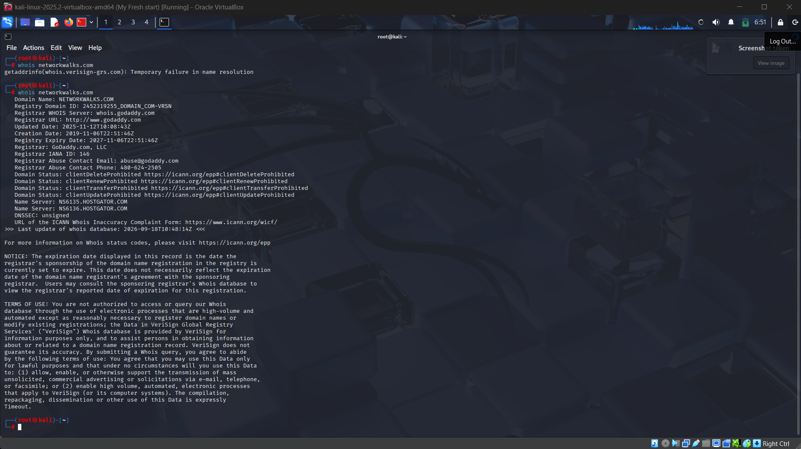
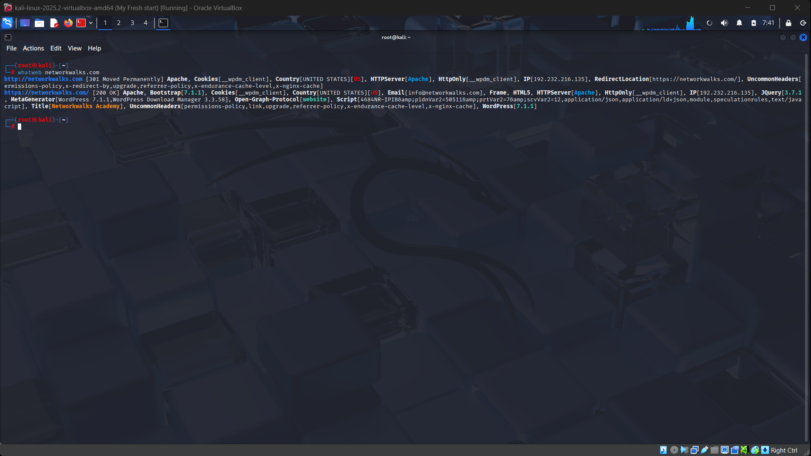
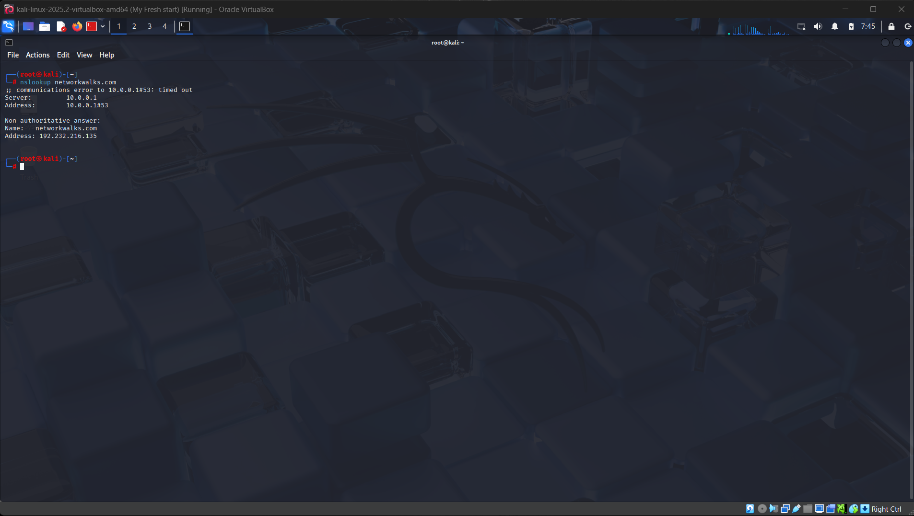
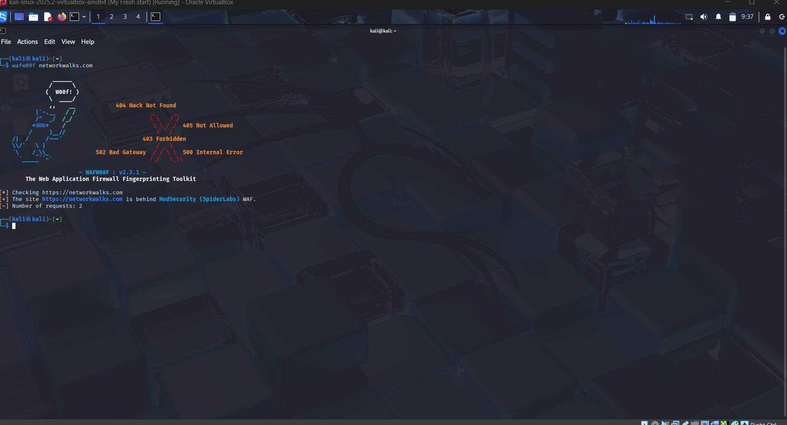
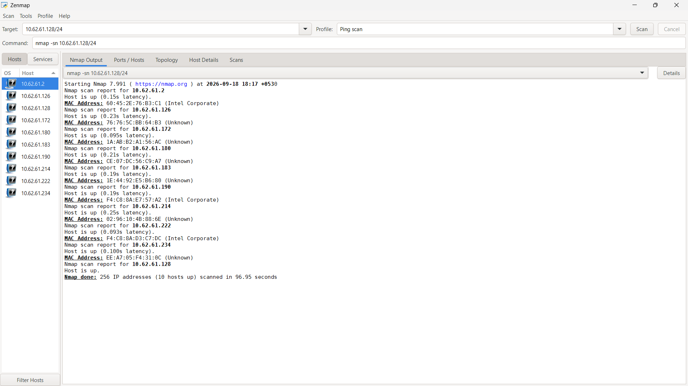
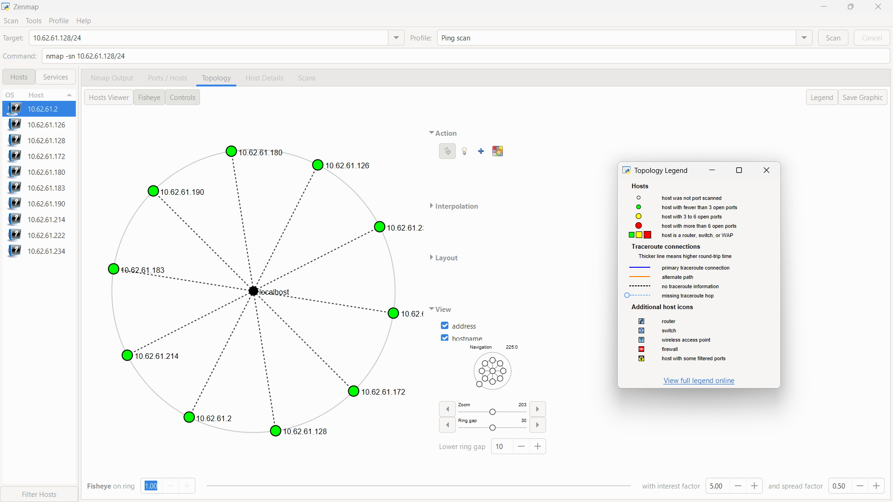

  
# Penetration Testing Report - Week 2

 

  
  
  

## 📋 Project Overview

This repository contains a comprehensive **penetration testing report** covering footprinting and network scanning phases. The project was completed as part of the Cybersecurity & Ethical Hacking internship at Networkwalks.

**Program:** Cybersecurity Professional B083  
**Duration:** Week 2  
**Date:** 18 September 2026  
**Status:** Phases 1-2 Complete | Phases 3-5 In Progress

---

## ⚠️ Liability Disclaimer

This project contains educational materials for authorized security testing only. All activities were performed with **secured written permission** on authorized systems. Unauthorized access to computer systems is illegal and can result in:
- Criminal charges
- Heavy fines
- Loss of employment
- Permanent criminal record

---

## 📖 Table of Contents

- [Overview](#overview)
- [Tools Used](#tools-used)
- [Activities Performed](#activities-performed)
- [Risk Analysis](#risk-analysis)
- [Recommendations](#recommendations)
- [Evidences](#evidences)
- [Author](#author)

---

## 🎯 Overview

This report documents:

1. **Phase 1: Footprinting & Reconnaissance**
   - Domain analysis using multiple Kali Linux tools
   - Technology fingerprinting
   - DNS enumeration
   - WAF detection

2. **Phase 2: Network Scanning**
   - Local network discovery using Zenmap
   - Active host identification
   - IP and MAC address mapping
   - Network topology generation

---

## 🛠️ Tools Used

| Tool | Purpose | Category |
|------|---------|----------|
| **WHOIS** | Domain registration details | Reconnaissance |
| **WhatWeb** | Web technology fingerprinting | Reconnaissance |
| **Nslookup** | DNS resolution | Reconnaissance |
| **Curl** | HTTP header inspection | Reconnaissance |
| **Wafw00f** | WAF detection | Reconnaissance |
| **DNSRecon** | DNS enumeration | Reconnaissance |
| **Zenmap** | Network scanning & discovery | Scanning |
| **Kali Linux** | Penetration testing OS | Infrastructure |
| **Windows CMD** | Local network identification | Infrastructure |

---

## 🔍 Activities Performed

### 4.1 Footprinting & Reconnaissance

#### WHOIS - Domain Registration
- **Command:** `whois networkwalks.com`
- **Purpose:** Extract domain registration details
- **Findings:** Domain registration info, nameservers, hosting infrastructure

#### WhatWeb - Technology Fingerprinting
- **Command:** `whatweb networkwalks.com`
- **Purpose:** Identify web technologies
- **Findings:** WordPress 7.1.1, WP Download Manager 3.3.58

#### Nslookup - DNS Resolution
- **Command:** `nslookup networkwalks.com`
- **Purpose:** Resolve domain to IP address
- **Findings:** IP Address: 192.232.216.135

#### Curl - HTTP Headers
- **Command:** `curl -I https://networkwalks.com`
- **Purpose:** Inspect HTTP response headers
- **Findings:** Exposed /wp-json/ endpoint, server info

#### Wafw00f - WAF Detection
- **Command:** `wafw00f networkwalks.com`
- **Purpose:** Detect Web Application Firewall
- **Findings:** ModSecurity (SpiderLabs) detected

#### DNSRecon - DNS Enumeration
- **Command:** `dnsrecon -d networkwalks.com`
- **Purpose:** Enumerate all DNS records
- **Findings:** NS, MX, SPF, TXT, SRV records identified

### 4.2 Network Scanning with Zenmap

#### Network Discovery
- **Command:** `ipconfig` (Windows) / `ifconfig` (Linux)
- **Purpose:** Identify local IP and subnet
- **Scan Type:** Ping Scan on 10.0.0.0/24

#### Live Host Identification
Identified active hosts:
- 10.62.61.2
- 10.62.61.172
- 10.62.61.180
- 10.62.61.183
- 10.62.61.190
- 10.62.61.214
- 10.62.61.222
- 10.62.61.234

#### Network Topology
- Generated Zenmap network topology visualization
- MAC address mapping
- Device relationship mapping

---

## ⚠️ Risk Analysis & Impact

| # | Risk Finding | Evidence | Impact | Risk Level |
|---|---|---|---|---|
| 1 | Web technology exposed | WhatWeb identified WordPress & plugins | Attackers may identify exploitable versions | 🟡 Medium |
| 2 | Server IP identifiable | Nslookup resolved 192.232.216.135 | Network location information disclosed | 🟡 Low |
| 3 | HTTP headers exposed | Curl revealed /wp-json/ endpoint | Assists technology fingerprinting | 🟡 Low |
| 4 | WAF technology exposed | Wafw00f identified ModSecurity | Reveals security architecture info | 🟡 Low |
| 5 | DNS records exposed | DNSRecon enumerated all records | Helps build infrastructure profile | 🟡 Medium |
| 6 | Multiple live hosts | Zenmap discovered 4 active hosts | Unknown devices may be present | 🟡 Medium |

**Risk Level Key:** 🔴 Critical | 🟡 Medium | 🟢 Low

---

## 💡 Recommendations

1. **Review publicly exposed technology information**
   - Minimize version information disclosure
   - Hide CMS and plugin details

2. **Keep software updated**
   - Regular WordPress updates
   - Plugin security patches
   - OS-level patches

3. **Review HTTP headers**
   - Remove unnecessary technical headers
   - Implement security headers (CSP, X-Frame-Options, etc.)

4. **Review DNS records**
   - Audit publicly exposed DNS information
   - Limit DNS enumeration capabilities

5. **Properly configure WAF**
   - Keep ModSecurity enabled and tuned
   - Monitor for false positives

6. **Perform regular network discovery**
   - Periodic internal network scans
   - Maintain device inventory

7. **Investigate unknown devices**
   - Verify all discovered devices
   - Document network topology

8. **Maintain network documentation**
   - Keep topology current
   - Update device inventory

9. **Perform security testing with authorization**
   - Always obtain written permission
   - Define clear scope

---

## 📸 Evidences

### WHOIS Output

*WHOIS query showing domain registration information and nameservers*

### WhatWeb Fingerprinting

*WhatWeb identifying WordPress 7.0.4 and associated plugins*

### Nslookup Resolution

*DNS resolution showing IP address 192.232.216.135*

### Curl HTTP Headers

*HTTP headers revealing WordPress REST API endpoint*

### Wafw00f WAF Detection

*WAF detection identifying ModSecurity (SpiderLabs)*

### Zenmap Network Scan

*Zenmap ping scan identifying 4 active hosts*

### Network Topology

*Network topology visualization with legend showing host relationships*

---

## 📝 Key Findings Summary

✅ **Completed:**
- Footprinting of networkwalks.com domain
- Technology identification and enumeration
- Local network discovery and mapping
- Risk assessment and recommendations

🔄 **In Progress:**
- Phases 3-5 (Vulnerability scanning, exploitation, etc.)

---

## 📚 Learning Outcomes

Through this practical exercise, I learned:

1. **Information Gathering** is critical in penetration testing
2. **OSINT Tools** like WHOIS, DNS tools help build target profiles
3. **Web Technology Fingerprinting** reveals attack surface
4. **Network Discovery** using Zenmap maps live hosts efficiently
5. **Risk Documentation** requires clear evidence and impact analysis
6. **Authorization** is mandatory for all security testing
7. **Professional Reporting** combines findings, risks, and remediation

---

## 🔐 Security Considerations

- ✅ All testing performed on authorized systems only
- ✅ Written permission obtained before activities
- ✅ Educational purposes only
- ✅ No exploitation or system compromise attempted
- ✅ Scope clearly defined and followed

---

## 📞 Contact & Author

**Name:** Osim Kumar Laha  
**Title:** Cybersecurity Novice  
**Program:** B083-Networkwalks  
**LinkedIn:** https://www.linkedin.com/in/osimlaha/

---

## 📄 License

This project is for **educational purposes only**. All materials are part of the Networkwalks Cybersecurity Program curriculum. Unauthorized use of these techniques against systems without explicit written permission is illegal.
  
> **Program:** Cybersecurity at Networkwalks | **Module:** Week 01 | PENETRATION TESTING
